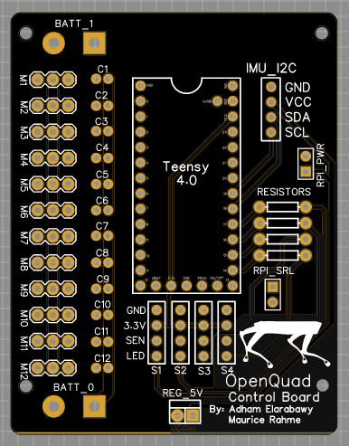

# OpenQuadruped
An open-source 3D-printed quadrupedal robot. Motion Algorithms for dynamic walking gaits, Artificial Intelligence & Visual SLAM for dynamic terrain mapping &amp; obstacle avoidance, Self-Balancing.

## 3D Model
In the model folder, you can find all of the modified step & stl files that I used for my build of OpenQuadruped.

#### Instructions
Note that the files that I provided are only for the left & front sides of the dog. The reason for this is that you can derive the other parts by simply mirroring the given parts in your slicer per my instruction.

#### Quantities
|Name|Quantity|File|Mirrored|
|---|---|---|---|
|Foot|4|[foot.stl](https://github.com/adham-elarabawy/OpenQuadruped/blob/master/model/stl/foot.stl)|no|
|Left Wrist|2|[Left_Wrist.stl](https://github.com/adham-elarabawy/OpenQuadruped/blob/master/model/stl/Left_Wrist.stl)|no|
|Left Upper Arm|2|[Left_Upper_Arm.stl](https://github.com/adham-elarabawy/OpenQuadruped/blob/master/model/stl/Left_Upper_Arm.stl)|no|
|Left Cover|2|[Left_Cover.stl](https://github.com/adham-elarabawy/OpenQuadruped/blob/master/model/stl/Left_Cover.stl)|no|
|FL/BR Hip Joint|2|[FL_BR_Hip_Joint.stl](https://github.com/adham-elarabawy/OpenQuadruped/blob/master/model/stl/FL_BR_Hip_Joint.stl)|no|
|Right Wrist|2|[Left_Wrist.stl](https://github.com/adham-elarabawy/OpenQuadruped/blob/master/model/stl/Left_Wrist.stl)|yes|
|Right Upper Arm|2|[Left_Upper_Arm.stl](https://github.com/adham-elarabawy/OpenQuadruped/blob/master/model/stl/Left_Upper_Arm.stl)|yes|
|Right Cover|2|[Left_Cover.stl](https://github.com/adham-elarabawy/OpenQuadruped/blob/master/model/stl/Left_Cover.stl)|yes|
|FR/BL Hip Joint|2|[FL_BR_Hip_Joint.stl](https://github.com/adham-elarabawy/OpenQuadruped/blob/master/model/stl/FL_BR_Hip_Joint.stl)|yes|

#### Images
  

## Hardware
I made a custom pcb board to control the position and speed of 12 servos simultaneously, as well as interface with all of the sensors.

You can find the gerber files for the custom pcb in the [hardware folder](https://github.com/adham-elarabawy/OpenQuadruped/tree/master/hardware) in this repository.

There are two versions: one that uses one power source to power all 12 servos and one that uses two power sources to power all 12 servos (in case of 2 batteries or two lower-current UBECs/Voltage regulators). Both version offer access to the teensy's serial pins, two I2C breakouts (in case you want to connect sensors) and a regulated 5V rail. The board uses 2mm wide traces + 2 ground planes in order to properly dissipate heat for high currents.

 

## Visualization Usage
To try the visualization tool out, you'll need to run the [animate.py](https://github.com/adham-elarabawy/OpenQuadruped/blob/master/visualization/animate.py) python file with the proper libraries installed. (matplotlib 3.0.3 supported).

You can then use keyboard controls: use x, y, z, a, p, r to select (x axis, y axis, z axis, yaw, pitch, roll), and then the up and down buttons to increment the selected position. If you click '1' on your keyboard, it will reset the position. 

Right now, if you try to go to an impossible pose that would result in collisions, the body will do some weird things. If that happens, just click "1" on your keyboard to reset the position. 

*Note: Pitch and Roll are currently not working. I am currently trying to fix that.*

## Demos

