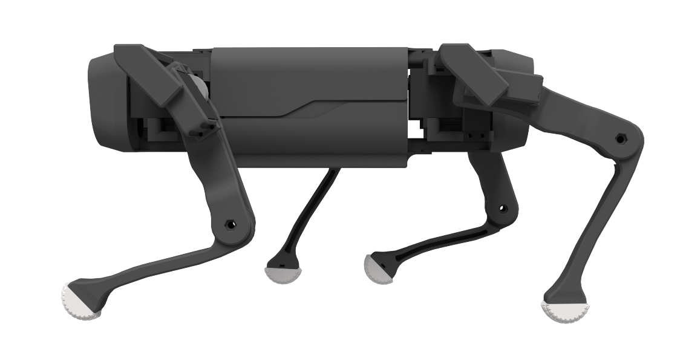

# open-quadruped

An open-source 3D-printed quadrupedal robot. Intuitive gait generation through 12-DOF Bezier Curves. Full 6-axis body pose manipulation. Custom 3DOF Leg Inverse Kinematics Model accounting for offsets.

 

## Current Status
### To-Do List

- [x] *Hardware* // Redesign legs to move actuators closer to hip + reinforce all servo mounting.
- [ ] *Design* // Research transition between gait & body pose.
- [x] *Software* // Implementing ROS infrastructure for all control processes (including cpp on teensy).
- [ ] *Software* // Write & automate pytest unit tests.
- [ ] *Software* // Integrate unit tests with github actions.
- [x] *Simulation* // Create URDF model. (or port collaborater's URDF: Maurice Rahme)
- [x] *Simulation* // Gazebo
- [ ] *Simulation* // RViz Realtime Model
- [ ] *Design* // Solve offset 3DOF IK model for right limbs _OR_ validate that mirroring angles works for left/right legs
- [ ] *Simulation* // Implement WebGazebo clientside support for non-linux users
- [ ] *Sim-to-Real* // Joint servo calibration
- [ ] *Sim-to-Real* // Refining gait parameters
- [ ] *Simulation* // Reinforcement learning via ARS
- [ ] *Software* // Raibert Huerestic for converting desired velocities into gait parameters
- [ ] *Software* // ROS Nav Stack Layer

  

## Papers
I've been formally documenting this project in the form of papers. You can find them here: [adham-e.dev/papers](https://adham-e.dev/papers)

## Documentation
I'm hosting most of the documentation for this project on [this repo's wiki](https://github.com/adham-elarabawy/OpenQuadruped/wiki).

## 3D Model
In the [model](https://github.com/adham-elarabawy/OpenQuadruped/tree/master/model) folder, you can find all of the step & stl files that I used for my build of OpenQuadruped. There, you can also find a Bill of Materials, and some guides (in progress). 

## Hardware
I made a custom pcb board to control the position and speed of 12 servos simultaneously, as well as interface with all of the sensors.

You can find the gerber files for the custom pcb in the [hardware folder](https://github.com/adham-elarabawy/OpenQuadruped/tree/master/hardware) in this repository.

You can find the bill of materials for this project [here](https://docs.google.com/spreadsheets/d/12QX1ca9LHZEThukprlz0DARR9_lmf6FJI8Tg-O4qcdc/edit?usp=sharing).

## Visualization Usage
To try the visualization tool out, you'll need to run the [animate.py](https://github.com/adham-elarabawy/OpenQuadruped/blob/master/visualization/animate.py) python file with the proper libraries installed. (matplotlib 3.0.3 supported).

You can then use keyboard controls: use x, y, z, a, p, r to select (x axis, y axis, z axis, yaw, pitch, roll), and then the up and down buttons to increment the selected position. If you click '1' on your keyboard, it will reset the position. 

Right now, if you try to go to an impossible pose that would result in collisions, the body will do some weird things. If that happens, just click "1" on your keyboard to reset the position. 

*Note: Pitch and Roll are currently not working. I am currently trying to fix that.*

## More Demos

