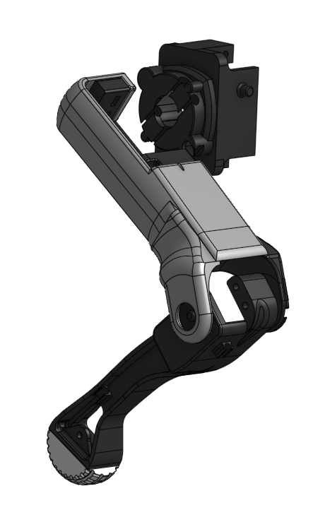
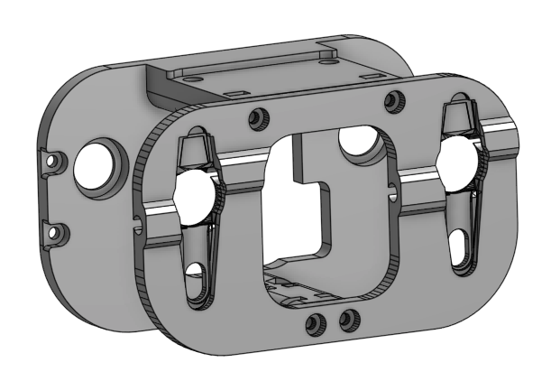

# 3D Model
In this folder, you can find all of the modified step & stl files that I used for my build of OpenQuadruped.

## Instructions
Note that the files that I provided are only for the left & front sides of the dog. The reason for this is that you can derive the other parts by simply mirroring the given parts in your slicer per my instruction.

## Quantities
|Name|Quantity|File|Mirrored|
|---|---|---|---|
|Foot|4|[foot.stl](https://github.com/adham-elarabawy/OpenQuadruped/blob/master/model/stl/foot.stl)|no|
|Left Wrist|2|[Left_Wrist.stl](https://github.com/adham-elarabawy/OpenQuadruped/blob/master/model/stl/Left_Wrist.stl)|no|
|Left Upper Arm|2|[Left_Upper_Arm.stl](https://github.com/adham-elarabawy/OpenQuadruped/blob/master/model/stl/Left_Upper_Arm.stl)|no|
|Left Cover|2|[Left_Cover.stl](https://github.com/adham-elarabawy/OpenQuadruped/blob/master/model/stl/Left_Cover.stl)|no|
|FL/BR Hip Joint|2|[FL_BR_Hip_Joint.stl](https://github.com/adham-elarabawy/OpenQuadruped/blob/master/model/stl/FL_BR_Hip_Joint.stl)|no|
|Right Wrist|2|[Left_Wrist.stl](https://github.com/adham-elarabawy/OpenQuadruped/blob/master/model/stl/Left_Wrist.stl)|yes|
|Right Upper Arm|2|[Left_Upper_Arm.stl](https://github.com/adham-elarabawy/OpenQuadruped/blob/master/model/stl/Left_Upper_Arm.stl)|yes|
|Right Cover|2|[Left_Cover.stl](https://github.com/adham-elarabawy/OpenQuadruped/blob/master/model/stl/Left_Cover.stl)|yes|
|FR/BL Hip Joint|2|[FL_BR_Hip_Joint.stl](https://github.com/adham-elarabawy/OpenQuadruped/blob/master/model/stl/FL_BR_Hip_Joint.stl)|yes|
|Inner Shoulder|2|[Inner_Shoulder.stl](https://github.com/adham-elarabawy/OpenQuadruped/blob/master/model/stl/Inner_Shoulder.stl)|no|
|Outer Shoulder Plate|2|[Outer_Shoulder_Plate.stl](https://github.com/adham-elarabawy/OpenQuadruped/blob/master/model/stl/Outer_Shoulder_Plate.stl)|no|
|Electronics Plate|1|[electronics_plate.stl](https://github.com/adham-elarabawy/OpenQuadruped/blob/master/model/stl/electronics_plate.stl)|no|
|Battery Clip|1|[Battery_Clip.stl](https://github.com/adham-elarabawy/OpenQuadruped/blob/master/model/stl/Battery_Clip.stl)|no|
|Controller Board Mount 0|1|[controller_board_mount_0.stl](https://github.com/adham-elarabawy/OpenQuadruped/blob/master/model/stl/controller_board_mount_0.stl)|no|
|Controller Board Mount 1|1|[controller_board_mount_1.stl](https://github.com/adham-elarabawy/OpenQuadruped/blob/master/model/stl/controller_board_mount_1.stl)|no|

## Images
  
